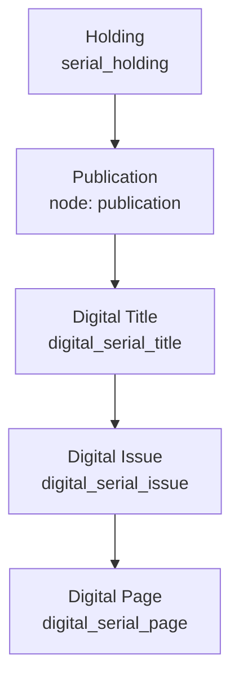

# Architecture

## Summary

NBNP is a Drupal 9 application that extends the UNB Libraries
[docker-drupal](https://github.com/unb-libraries/docker-drupal) base image (nginx and
PHP-FPM). It stores metadata in MariaDB, indexes content in Apache Solr for faceted
search, and uses Redis for caching. Custom modules model digitized newspapers as a
hierarchy of serial entities.

## Components

| Component | Technology | Role |
| --------- | ---------- | ---- |
| Application | Drupal 9 (`ghcr.io/unb-libraries/drupal:9.x-2.x-unblib`) | nginx + PHP-FPM serving the site |
| Database | MariaDB 10.11 | Nodes, custom entities, configuration |
| Search | Apache Solr 8 (`ghcr.io/unb-libraries/solr-drupal:8.x-4.x`) | Faceted search over titles and pages |
| Cache | Redis 7 | Drupal cache backend |

Two Solr cores are provisioned: `newspapers.lib.unb.ca` and
`pages.newspapers.lib.unb.ca`. See [Configuration](configuration.md) for details.

### Custom modules

The newspaper domain logic lives in custom Drupal modules, including
`digital_serial` (the serial entity types), `newspapers_core` (project-specific
operations such as moving and re-indexing issues), `panb`, and `serials`.

## Content model

NBNP stores newspaper assets as four related entity types plus a holding record. It
is important to understand these relationships before correcting any linking problems.

| Entity | Storage type | Bundle / table | Description |
| ------ | ------------ | -------------- | ----------- |
| Publication | Node | `publication` | Metadata record holding the full information and history of a newspaper title. |
| Digital Title | Custom entity | `digital_serial_title` | A relational record that links Digital Issues to a Publication. |
| Digital Issue | Custom entity | `digital_serial_issue` | Metadata for a single issue of the Publication, plus its Digital Pages. |
| Digital Page | Custom entity | `digital_serial_page` | Metadata, text content, and the image for a single page of an issue. |
| Holding | Custom entity | `serial_holding` | A physical or digital holding at an institution. A digital holding always references an NBNP serial title with `holding.type = 'Digital'` and `holding.coverage = 'Digital Issues at UNB Libraries'`. |

A Publication can have one or more Digital Titles; each Digital Title groups the
Digital Issues that belong to it; each Digital Issue contains its Digital Pages.
Holdings attach to the Publication and record where the title is held.

For the procedures that move issues and titles between these entities, see
[Correct improperly linked assets](howto/correct-improperly-linked-assets.md).
