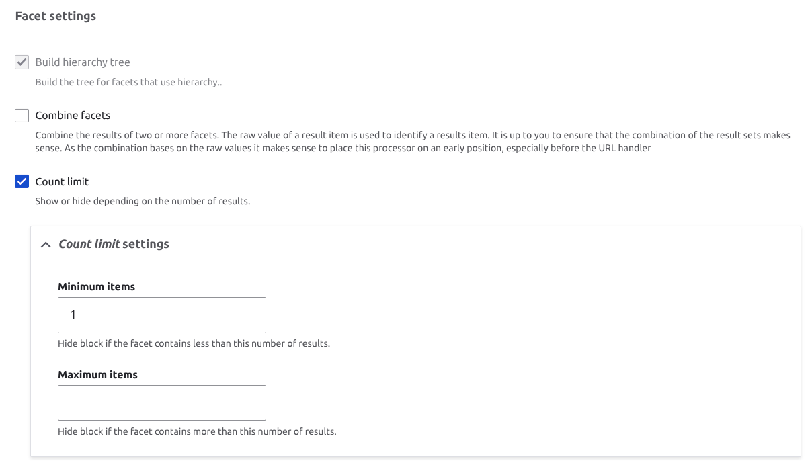
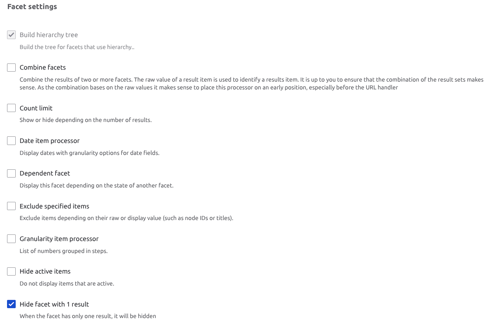

# Troubleshooting

## Range slider facet labels do not match filtered results

**Problem.** Search results sometimes do not filter correctly when using the range
slider facet widget. The min and max labels shown on the slider are sometimes out of
line with the values actually submitted to the search, which misleads users. Reported
in support tickets [21576](https://support.lib.unb.ca/default.asp?21576) and
[21894](https://support.lib.unb.ca/default.asp?21894).

**Cause.** The discrepancy appears to come from how large result sets are mapped to
points on the slider by **jQuery UI Slider Pips**, the library required by the Facets
Range Widget module. The library is compatible with Drupal 11 but is
[no longer actively maintained](https://github.com/simeydotme/jQuery-ui-Slider-Pips).

**Resolution.** The problem is tied to using the **Count limit** facet setting to hide
the range widget block for searches that return no results.

Using **Hide facet with 1 result** in place of the **Count limit** setting also hides
the facet when zero results are returned, and resolves the inaccurate slider label.

Because the underlying library is unmaintained, treat this as a workaround rather than
a permanent fix.
